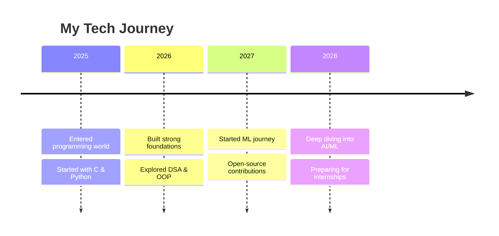

# 👋 Hi there, I'm Saqib Manzoor Dar!

<p align="center">
  
</p>

---

## 🧠 About Me

```python
class SaqibManzoorDar:
    def __init__(self):
        self.role = "BTech Student (CSE - AIML)"
        self.passion = ["Artificial Intelligence", "Machine Learning", "System Programming"]
        self.motto = "Think deeply. Code cleanly. Debug smartly."
        self.current_focus = "Building strong foundations in DSA & ML"
    
    def say_hi(self):
        print("Thanks for stopping by! Let's connect and build something amazing together :)")

me = SaqibManzoorDar()
me.say_hi()
```

💡 **Curious Mind. Logical Thinker. Constant Learner.**  
I love building small but meaningful projects to understand how technology actually thinks and works behind the scenes.

---

## 🛠️ Tech Stack & Tools

### 💻 Languages


### 🧠 Core Concepts
- 🤖 AI/ML Fundamentals
- 📊 Data Structures & Algorithms
- 🔄 Object-Oriented Programming
- 🗄️ Database Management
- 📈 Statistical Analysis

### ⚙️ Tools & Platforms


---

## 📊 GitHub Analytics

<p align="center">
  
  
</p>

<p align="center">
  
</p>

---

## 🚀 Featured Projects

| Project | Description | Tech Stack | Status |
|:--------|:------------|:-----------|:-------|
| 🧩 **Control Flow in C++** | Comprehensive demonstration of loops, conditions, and flow control | C++ | 🚧 In Progress |
| 🤖 **ML Model Experiments** | Regression and classification models from scratch | Python, scikit-learn, pandas | 🚧 In Progress |
| 💼 **Portfolio Website** | Personal portfolio to showcase my work | HTML, CSS, JS | ✅ Complete |
| 📊 **Data Analysis Project** | Exploratory data analysis and visualization | Python, Pandas, Matplotlib | ⏳ Planned |

---

## 📈 Learning Journey Timeline



---

## 🌱 Current Focus

- 🔭 **Deepening** my understanding of **Machine Learning algorithms**
- 📚 **Mastering** **Data Structures & Algorithms** in C++
- 👯 **Looking to collaborate** on beginner-friendly **open-source ML projects**
- 🎯 **Preparing** for **technical interviews** and internships
- ⚡ **Actively solving** problems on **LeetCode** and **HackerRank**

---

## 🏆 Achievements & Certifications

- [ ] 🎓 **Complete Andrew Ng's Machine Learning Specialization** *(Planned)*
- [ ] 📜 **Python for Everybody Specialization** - University of Michigan *(completed)*
- [ ] 🏅 **100 Days of Code Challenge** - Python *(30 days completed)*
- [ ] ⭐ **5-Star Badge** in C++ on HackerRank

---

## 📫 Let's Connect!

<p align="center">
  <a href="https://linkedin.com/in/saqib-manzoor-dar-986141363">
    
  </a>
  <a href="https://twitter.com/your-twitter-handle">
    
  </a>
  <a href="mailto:your.darsqib114@gmail.com">
    
  </a>
  <a href="https://saqibmanzoor.vercel.app">
    
  </a>
  <a href="https://leetcode.com/your-leetcode-username">
    
  </a>
</p>

---

## ⚡ Fun Corner

```javascript
// My debugging philosophy
while (!success) {
    attempt++;
    learn();
    improve();
    if (learnedFromMistakes) {
        success = true;
    }
}
// Spoiler: success always comes! 💪
```

> 🔥 **Fun Fact:** I don't chase perfection — I debug towards it. Every broken code teaches me something a tutorial can't!

---

## 🎯 Quote That Drives Me

<p align="center">
  <i>"The best way to predict the future is to create it — with code."</i>
  <br/>
  <b>- Abraham Lincoln (adapted for developers 😉)</b>
</p>

---

## 🌟 Profile Visitors

<p align="center">
  
</p>

<p align="center">
  
</p>


⭐ If you like what I do, consider following me  let's grow and build together!
